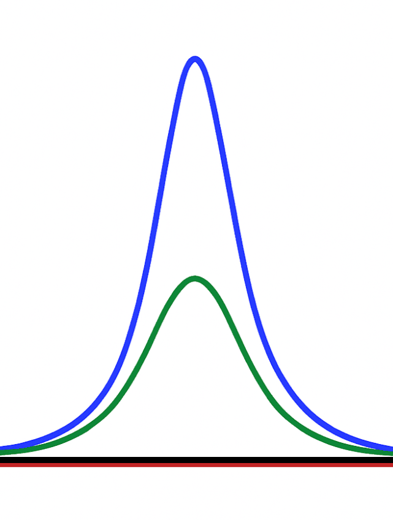

<h1 align="center"> SangerAnalyst — A Free, Web-Based Sanger Sequencing Analysis Tool</h1>

  

---

SangerAnalyst provides a lightning-fast and straightforward way to process Sanger chromatograms within seconds—no installation required and 100% free.

The application performs automated quality trimming, forward–reverse read alignment, consensus generation guided by per-base Phred scores, and anchor-based primer trimming. It also produces a clear conflict report, making mismatches, gaps, and low-confidence positions immediately visible.

This streamlined workflow enables users to obtain an accurate consensus sequence while saving significant time and avoiding the usual manual analysis headaches.

👉 **Support new features on the web:**  
https://bioassembly.github.io/sangeranalyst

---

## 📂 Demo Dataset

A publicly available control dataset is provided for users to test the tool without uploading their own files.

### **Source**
CRISPR-Cas9 edited cane toad *tyrosinase* gene — control samples (public domain data)  
DOI: https://doi.org/10.1101/2025.05.15.654396

### **Included demo files**
- `fwd_control.ab1`  
- `rev_control.ab1`  
- `primer_fwd.fasta`  
- `primer_rev.fasta`  

These files are available in the **`public/demo/`** directory of this repository (also loadable directly in the app via the **Try demo data** button).

---

## 🚀 Usage Guide

### **1. Open the Webpage**  
Visit **https://bioassembly.github.io/sangeranalyst**

### **2. Upload Input Files**
Prepare the following files:  
- Forward read chromatogram (`.ab1`)  
- Reverse read chromatogram (`.ab1`)  
- Primers (optional; can be uploaded or typed)

### **3. Adjust Processing Settings (Optional)**  
Defaults work well for most datasets.  
- **Mott Trim Cutoff** — Controls how aggressively low-quality regions are removed before alignment.  
- **Minimum Base Phred Quality** — Bases below this threshold are replaced with **`N`**.
- **Secondary peak threshold (%)** — Controls the sensitivity for detecting mixed bases (heterozygotes).

  
### **4. Run `Analyze`**  
The backend processes each request in ~0.4 seconds, uploaded data is deleted immediately after processing.

### **5. Inspect Results**
You will receive 2 outputs (3 if primer included):

#### 🔹 High-Confidence Consensus  
Derived from the overlapping region of forward–reverse alignment (statistically validated). Conflicts and gaps are reported: sequencing errors are corrected from the higher-quality strand, and heterozygous positions confirmed by secondary peaks are kept as IUPAC ambiguity codes.

#### 🔹 Full Merge  
A full-span merge of both chromatogram alignments. This is where long reads shine: on a ~1,500 bp amplicon, ~900 bp forward and reverse reads share only ~300 bp of overlap — the Full Merge reconstructs the entire 1,500 bp span, while bases outside the overlap originate from a single read (keep that caveat in mind for conclusions). For short amplicons it is mainly useful for mapping and reference visualization.

#### 🔹 Primer-Trimmed Consensus  
Primer regions removed from the full merge:  
`---Primer_F | -----High Confidence Consensus----- | Primer_R---`  
This provides the longest methodologically reliable sequence, though meaning it's outside High Confidence Consensus region originate from single-read data, which may still have some mismatch or gap compared to the real life biologic DNA sequence.

---

## 🛠️ Roadmap (To-Do Next)

- 📱 **Mobile UI improvements** — better layout, larger buttons, smoother long-sequence handling.  
- 📈 **Chromatogram viewer** — interactive peak traces for conflict inspection.  
- 🧬 **Gene annotations** — automatic ORF detection.  
- 🧭 **Reference mapping** — align consensus to a reference and highlight differences.  
- 📦 **Batch processing** — analyze multiple samples at once.

---

## 📚 Acknowledgement

This project uses **BioPython** for AB1 parsing and core sequence utilities. Its modules provide reliable foundational functions required for Sanger data processing.

---

  Made for easy, fast, and accurate Sanger sequencing analysis.

